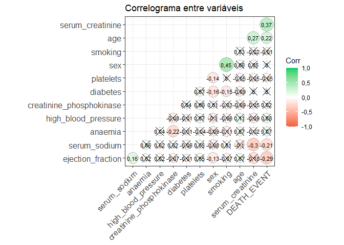
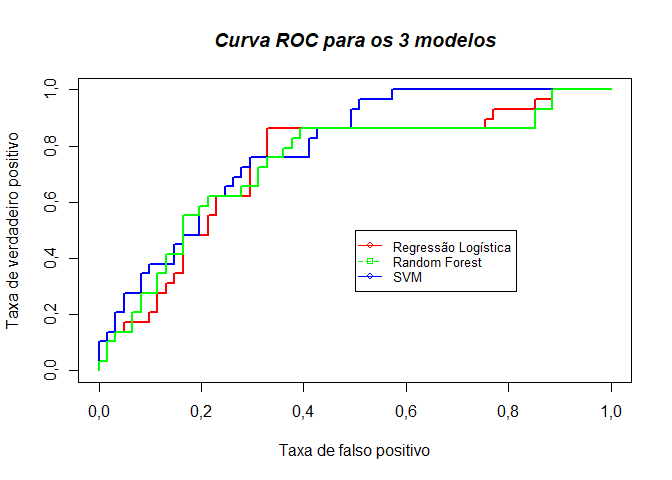

Análises de Machine Learning
================
Joziani Mota Vieira

<div style="width: 100% text-align: justify">

Vou utilizar o banco de dados encontrado no kaggle
(<https://www.kaggle.com/andrewmvd/heart-failure-clinical-data>) que
contém 12 características clínicas para previção de mortalidade por
insuficiência cardíaca.

</div>

## Pacotes e funções

``` r
rm(list=ls())
options(OutDec=",")

if(!require(tidyverse)){install.packages('tidyverse');require(tidyverse)}
if(!require(caret)){install.packages('caret'); require(caret)} 
if(!require(ROCR)){install.packages('ROCR'); require(ROCR)}

tab <- function(x){
  t1 <- cbind(table(x), round(prop.table(table(x))*100, 2))
}

basic <- function(x, more=F) {
  stats <- list()

  stats$N <- length(x)
  stats$Media <- round(mean(x),2)
  stats$D.P <- round(sd(x),2)
  
  t1 <- unlist(stats)
  names(t1) <- c("N", "Média", "D.P.")
  t1
}

metricas <- function(mod, mod.class, mod.probs){

  #predicting the test data
  mod.labels <- as.factor(Teste$DEATH_EVENT)
  mod.confusion <- confusionMatrix(mod.labels, mod.class)
  mod.accuracy <- round(as.numeric(mod.confusion$overall[1]),3)
  mod.sensitivity <- round(as.numeric(mod.confusion$byClass[1]),3)
  mod.specificity <- round(as.numeric(mod.confusion$byClass[2]),3)
  
  #roc analysis for test data
  mod.prediction <- prediction(mod.probs, mod.labels)
  mod.performance <- performance(mod.prediction,"tpr","fpr")
  mod.auc <- round(performance(mod.prediction,"auc")@y.values[[1]],3)
  
  tabela <- data.frame(Acurácia = mod.accuracy,
                       Sensibilidade  = mod.sensitivity,
                       Especificidade = mod.specificity,
                       AUC = mod.auc)
  
  return(list(medida=tabela, performace=mod.performance))
}
```

## Leitura dos dados

O banco de dados está composto pelas variáveis: <br /> age = Idade
<br /> anaemia = Se possui anemia <br /> creatinine\_phosphokinase =
Nível da enzima CPK no sangue (mcg / L) <br /> diabetes = Se possui
diabetes <br /> ejection\_fraction = Porcentagem de sangue saindo do
coração a cada contração (porcentagem) <br /> high\_blood\_pressure = Se
possui pressão alta <br /> platelets = Plaquetas no sangue (quiloplacas
/ mL) <br /> serum\_creatinine = Nível de creatinina sérica no sangue
(mg / dL) <br /> serum\_sodium = Nível de sódio sérico no sangue (mEq /
L) <br /> sex = Sexo - 1 = Masculino e 0 - Feminino <br /> smoking = Se
é fumante <br /> DEATH\_EVENT = Se morreu <br />

``` r
df <- readxl::read_xlsx('dados/Dados R.xlsx')
df
```

    # A tibble: 299 x 12
         age anaemia creatinine_phos~ diabetes ejection_fracti~ high_blood_pres~
       <dbl>   <dbl>            <dbl>    <dbl>            <dbl>            <dbl>
     1    75       0              582        0               20                1
     2    55       0             7861        0               38                0
     3    65       0              146        0               20                0
     4    50       1              111        0               20                0
     5    65       1              160        1               20                0
     6    90       1               47        0               40                1
     7    75       1              246        0               15                0
     8    60       1              315        1               60                0
     9    65       0              157        0               65                0
    10    80       1              123        0               35                1
    # ... with 289 more rows, and 6 more variables: platelets <dbl>,
    #   serum_creatinine <dbl>, serum_sodium <dbl>, sex <dbl>, smoking <dbl>,
    #   DEATH_EVENT <dbl>

## Análises Descritivas

Observa-se que não houve dados faltantes. A maior parte dos indivíduos
não morreram, não tinham anemia, nem diabetes ou pressão alta. A
maioria dos indivíduos foi do sexo masculino e não fumava.

``` r
sum(is.na(df) == T)
```

    [1] 0

``` r
tabela <- t(apply(df %>% dplyr::select(DEATH_EVENT,
                                       anaemia,
                                       diabetes,
                                       high_blood_pressure,
                                       sex,
                                       smoking), 2, tab))
colnames(tabela) <- c('N - 0', 'N - 1', '% - 0', '% - 1')
tabela
```

``` 
                    N - 0 N - 1 % - 0 % - 1
DEATH_EVENT           203    96 67,89 32,11
anaemia               170   129 56,86 43,14
diabetes              174   125 58,19 41,81
high_blood_pressure   194   105 64,88 35,12
sex                   105   194 35,12 64,88
smoking               203    96 67,89 32,11
```

A média da idade foi de 60,83, com desvio padrão de 11,89. <br /> A
média do o nível da enzima CPK no sangue foi de 581,84, com desvio
padrão de 970,29. <br /> A média da porcentagem de sangue saindo do
coração a cada contração foi de 38,08, com desvio padrão de 11,83.
<br /> A média das plaquetas no sangue foi de 263358,03, com desvio
padrão de 97804,24. <br /> A média do nível de creatinina sérica no
sangue foi de 1,39, com desvio padrão de 1,03. <br /> A média do nível
de sódio sérico no sangue foi de 136,63, com desvio padrão de 4,41.

``` r
t(apply(df %>% dplyr::select(age,
                             creatinine_phosphokinase,
                             ejection_fraction,
                             platelets,
                             serum_creatinine,
                             serum_sodium), 2, basic))
```

``` 
                           N     Média     D.P.
age                      299     60,83    11,89
creatinine_phosphokinase 299    581,84   970,29
ejection_fraction        299     38,08    11,83
platelets                299 263358,03 97804,24
serum_creatinine         299      1,39     1,03
serum_sodium             299    136,63     4,41
```

## Correlação

Houve correlação positiva e significativa entre se morreu e a variável
nível de creatinina sérica no sangue e a variável idade. <br /> Houve
correlação negativa e significativa entre se morreu e a variável nível
de sódio sérico no sangue e a porcentagem de sangue saindo do coração a
cada contração.

``` r
corelacao <- cor(as.matrix(df), method = 'spearman')
p.mat <- ggcorrplot::cor_pmat(as.matrix(df))

ggcorrplot::ggcorrplot(corelacao, hc.order = TRUE, 
                       type = 'lower', 
                       lab = TRUE, 
                       lab_size = 3, 
                       method = 'circle', 
                       colors = c('tomato2', 'white', 'springgreen3'), 
                       title= 'Correlograma entre variáveis', 
                       p.mat = p.mat,
                       ggtheme = theme_bw)
```

<!-- -->

## Método Holdout

O método holdout é usado para validação de dados, nele se divide o banco
de dados entre treino e teste, sendo que o banco treino é utilizado para
treinar os modelos e o banco teste é usado para cálculo de medidas de
desempenho dos modelos. Sendo que aqui foi usado 70% dos dados para
treino e 30% para teste.<br /><br />

Podemos observar que não há preditores com variância zero e combinações
lineares no banco de dados treino e teste.

``` r
set.seed(123)
id_sample <-  1:(dim(df)[1]) %>% 
  sample(size = 209, replace = F)

Treino <- data.frame(df[id_sample,]) # 70%
Treino %>% dim()
```

    [1] 209  12

``` r
Teste <- data.frame(df[-id_sample,]) # 30%
Teste %>% dim()
```

    [1] 90 12

``` r
# verificar se existe preditores com variância zero
length(nearZeroVar(Treino))
```

    [1] 0

``` r
length(nearZeroVar(Teste))
```

    [1] 0

``` r
# Enumera e resolve as combinações lineares em uma matriz numérica
findLinearCombos(Treino %>% dplyr::select(-DEATH_EVENT) %>% 
                   data.matrix)
```

    $linearCombos
    list()
    
    $remove
    NULL

``` r
findLinearCombos(Teste %>% dplyr::select(-DEATH_EVENT) %>% 
                   data.matrix)
```

    $linearCombos
    list()
    
    $remove
    NULL

## Modelos

### Regressão Logística

``` r
f <- as.formula(paste('DEATH_EVENT ~',
                      paste(names(Treino %>% dplyr::select(-DEATH_EVENT)),
                            collapse =' + ')))
f
```

    DEATH_EVENT ~ age + anaemia + creatinine_phosphokinase + diabetes + 
        ejection_fraction + high_blood_pressure + platelets + serum_creatinine + 
        serum_sodium + sex + smoking

``` r
mod_reg <- glm(f, 
                 family = binomial, 
                 data = Treino)

cutoff_reg <- lapply(as.list(seq(0.3,0.7,0.01)),
                     function(x){
                       table(ifelse(predict(mod_reg, Treino, 
                                            type = 'response') >= x, 1, 0), 
                             Treino$DEATH_EVENT) %>% 
                         prop.table() %>% 
                         diag() %>% 
                         sum()})

ponto_corte_reg <- seq(0.3,0.7,0.01)[which.max(cutoff_reg)]

mod.probs_reg <- predict(mod_reg, Teste, type = 'response')

mod.class_reg <- as.factor(ifelse(mod.probs_reg >= ponto_corte_reg, 1, 0))

medidas_reg <- metricas(mod_reg, mod.class_reg, mod.probs_reg)$medida
performace_reg <- metricas(mod_reg, mod.class_reg, mod.probs_reg)$performace
```

### Random Forest

``` r
set.seed(123)
mod_rf <- randomForest::randomForest(f, data = Treino,
                                       importance = TRUE)

cutoff_rf <-  lapply(as.list(seq(0.3,0.7,0.01)),
                     function(x){
                       table(ifelse(predict(mod_rf, Treino, 
                                            type = 'response')>=x, 1, 0), 
                             Treino$DEATH_EVENT) %>% 
                         prop.table() %>% 
                         diag() %>% 
                         sum()})

ponto_corte_rf <-  seq(0.3,0.7,0.01)[which.max(cutoff_rf)]

mod.probs_rf <- predict(mod_rf, Teste, type = 'response')

mod.class_rf <- as.factor(ifelse(mod.probs_rf >= ponto_corte_rf, 1, 0))

medidas_rf <- metricas(mod_rf, mod.class_rf, mod.probs_rf)$medida
performace_rf <- metricas(mod_rf, mod.class_rf, mod.probs_rf)$performace
```

### Support Vector Machines

``` r
mod_svm <-  e1071::svm(f, data = Treino,
                       kernel = 'radial', 
                       type = 'C-classification',
                       cost = 10, gamma = 0.01, coef0 = 1,
                       probability = TRUE)


mod.class_svm <- predict(mod_svm, Teste)
mod.probs_svm <- attr(predict(mod_svm, Teste, probability = TRUE), 
                  'probabilities')[,2]

medidas_svm <- metricas(mod_svm, mod.class_svm, mod.probs_svm)$medida
performace_svm <- metricas(mod_svm, mod.class_svm, mod.probs_svm)$performace
```

### Medidas dos Modelos

Nota-se que os valores estão bem próximos, e já que o modelo de
regressão logística é um modelo que consegue-se extrair interpretações,
já os modelos Random Forest e SVM são caixa preta, dependendo do tipo de
resultados esperados é recomendável utilizar o modelo de regressão.

``` r
medidas_tab <- data.frame(rbind(medidas_reg,
                                medidas_rf,
                                medidas_svm))
rownames(medidas_tab) <- c('Regressão',
                           'Random Forest',
                           'SVM')

t(medidas_tab)
```

``` 
               Regressão Random Forest   SVM
Acurácia           0,700         0,722 0,722
Sensibilidade      0,750         0,810 0,757
Especificidade     0,545         0,562 0,600
AUC                0,735         0,790 0,733
```

### Curva ROC

``` r
plot(performace_reg, col = 'red', lwd = 2, 
     xlab = 'Taxa de falso positivo',
     ylab = 'Taxa de verdadeiro positivo')
plot(performace_rf, add = TRUE, col = 'blue', lwd = 2)
plot(performace_svm, add = TRUE, col = 'green', lwd = 2)
title(main='Curva ROC para os 3 modelos', font.main = 4)
plot_range <- range(0,0.5,0.5)
legend(0.5, plot_range[2], c('Regressão Logística', 'Random Forest', 'SVM'), 
       cex = 0.8, col = c('red','green','blue'), pch = 21:22, lty = 1:2)
```

<!-- -->
